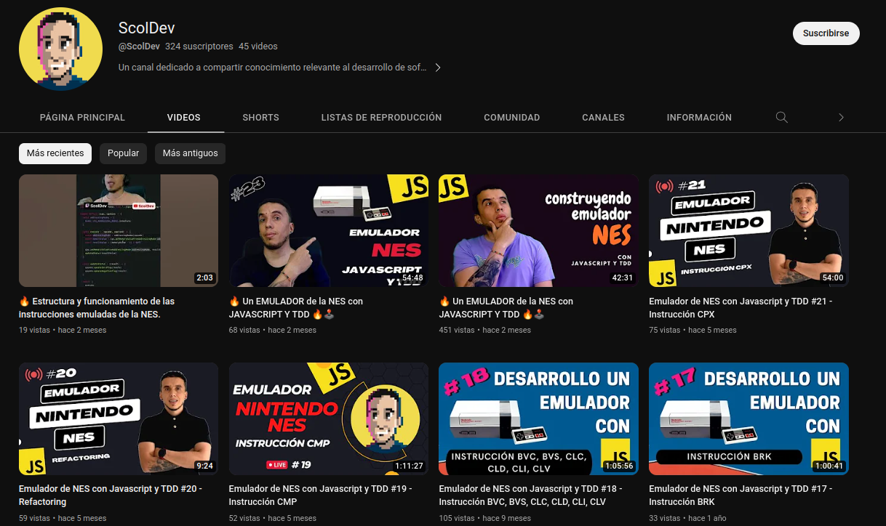

# CaNES
---

Es un emulador de la Nintendo NES (Nintendo Entertainment System) desarrollado con JavaScript vanilla e implementando la metodología de desarrollo guiado por pruebas TDD (Test Driven Development).

## ¿Por qué un emulador de la NES?

Surge como respuesta a la búsqueda de un proyecto que permitiera unificar algunos aspectos de mi interés:

- Mi admiración por los juegos en 8 bits de la consola NES
- El gusto que tengo por conocer las arquitecturas de bajo nivel y cómo estas funcionan
- El deseo de aprender y evidenciar los beneficios de implementar la metodología Test Driven Development (TDD)

## ¿Por qué JavaScript y no TypeScript?

- Respuesta corta: ¿Por qué no?
- Respuesta larga: Porque es una manera de evidenciar mucho mejor algunos de los beneficios de implementar la metodología TDD, con la cual desarrollamos una solución desde cero, reduciendo la probabilidad de introducir errores mediante pruebas de código bien construidas y con sentido, sin la necesidad de depender de otras herramientas adicionales.

## ¿Cómo la voy construyendo?

Mi canal de YouTube tiene las respuestas:

[@ScolDev](https://www.youtube.com/playlist?list=PLqavSrl_owSZKrR9lg00lzoDDI1nyvfZ8)

## Progreso

Para tener un panorama general del avance del proyecto, se destacan las 4 características más importantes que debe tener el emulador de la NES para considerarse como terminado. Cada uno de estos elementos tiene sus propios detalles de acuerdo a la arquitectura de la misma y las necesidades pertinentes para interactuar con los demás componentes de la NES.

- CPU (Actual)
- PPU
- APU
- Input Devices

## ¿Habrá más?

En el transcurso del proyecto han surgido múltiples ideas que podrían complementar el desarrollo del emulador para crear un conjunto de aplicaciones atractivas para los fanáticos de la consola y los juegos de 8 bits, pero la implementación de las mismas dependerá estrictamente de la completitud del emulador base.